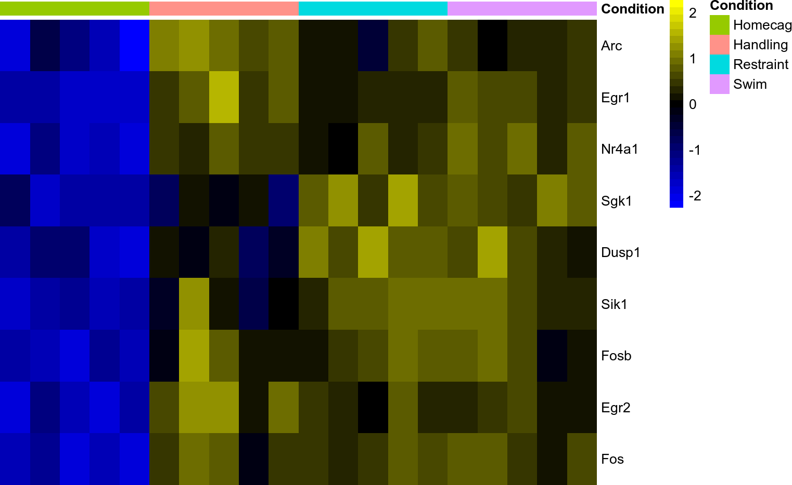
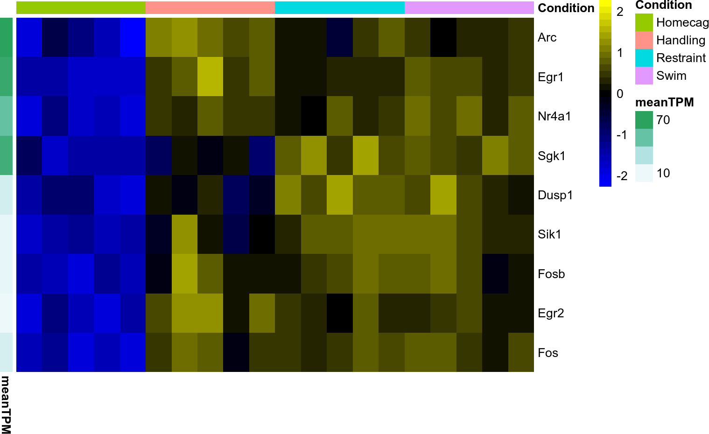
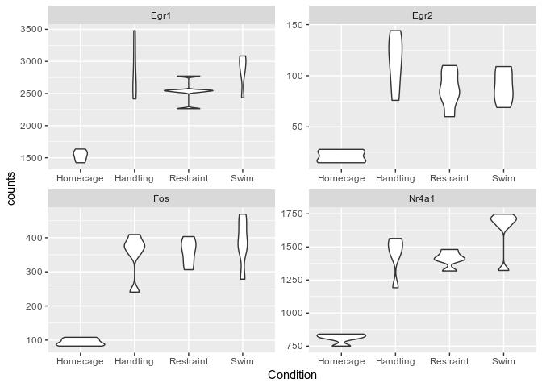

# SEtools

The *SEtools* R package is a set of convenience functions for the _Bioconductor_ class *[SummarizedExperiment](https://bioconductor.org/packages/3.9/SummarizedExperiment)*. It facilitates merging, melting, and plotting `SummarizedExperiment` objects.

***

## Getting started

### Installing

Install with:

```{r}
devtools::install_github("plger/SEtools")
```

### Example data

To showcase the main functions, we will use an example object which contains (a subset of) whole-hippocampus RNAseq of mice after different stressors (taken from [Floriou-Servou et al., Biol Psychiatry 2018](https://doi.org/10.1016/j.biopsych.2018.02.003)) :

```r
suppressPackageStartupMessages({
  library(SummarizedExperiment)
  library(SEtools)
})
data("SE", package="SEtools")
SE
```

```
## class: SummarizedExperiment 
## dim: 100 20 
## metadata(0):
## assays(3): counts logcpm tpm
## rownames(100): Egr1 Nr4a1 ... CH36-200G6.4 Bhlhe22
## rowData names(2): meanCPM meanTPM
## colnames(20): HC.Homecage.1 HC.Homecage.2 ... HC.Swim.4 HC.Swim.5
## colData names(2): Region Condition
```


## Heatmaps

### sehm

The `sehm` function simplifies the generation of heatmaps from `SummarizedExperiment`. 
It uses *[pheatmap](https://CRAN.R-project.org/package=pheatmap)*, so any argument supported by it can in principle be passed:


```r
g <- c("Egr1", "Nr4a1", "Fos", "Egr2", "Sgk1", "Arc", "Dusp1", "Fosb", "Sik1")
sehm(SE, genes=g, scale="row")
```

<!-- -->

Annotation from the object's `rowData` and `colData` can be plotted simply by specifying the column name (some will be shown by default if found):

```r
sehm(SE, genes=g, scale="row", anno_rows="meanTPM")
```

<!-- -->

These can also be used to create gaps:

```r
sehm(SE, genes=g, scale="row", anno_rows="meanTPM", gaps_at="Condition")
```

<!-- -->

The specific assay to use for plotting can be specified with the `assayName` argument.

### crossHm

Heatmaps from multiple SE can be created either by merging the objects (see below), or using the `crossHm` function, which uses the *[ComplexHeatmap](https://CRAN.R-project.org/package=ComplexHeatmap)* package:


```r
anno_colors <- list( Condition= c(Homecage="green",
                                  Handling="orange",
                                  Restraint="red",
                                  Swim="blue")
                   )
crossHm( list(se1=SE, se2=SE), g, anno_colors=anno_colors ) 
```

<!-- -->

### Default arguments

For some arguments (for instance colors), if they are not specified in the function call, `SEtools` will try to see whether the corresponding global options have been set, before using default colors. This means that if, in the context of a given project, the same colors are repeatedly being used, they can be specified a single time, and all subsequent plots will be affected:

```
options("SEtools_def_hmcols"=c("white","grey","black"))
ancols <- list( Condition=c( Homecage="green",
                             Handling="orange",
                             Restraint="red",
                             Swim="blue" ) )
options("SEtools_def_anno_colors"=ancols)
sehm(SE, g, do.scale = TRUE)
```

<!-- -->

At the moment, the following arguments can be set as global options:
`assayName`, `hmcols`, `anno_columns`, `anno_rows`, `anno_colors`, `gaps_at`, `breaks`.
Options must be set with the prefix `SEtools_def_`, followed by the name of the argument.
You may use `resetAllSEtoolsOptions()` to remove all global options relative to the package.

***

## Merging SEs


```r
se1 <- SE[,1:10]
se2 <- SE[,11:20]
se3 <- mergeSEs( list(se1=se1, se2=se2) )
se3
```

```
## class: SummarizedExperiment 
## dim: 100 20 
## metadata(0):
## assays(3): counts logcpm tpm
## rownames(100): AC139063.2 Actr6 ... Zfp667 Zfp930
## rowData names(2): meanCPM meanTPM
## colnames(20): se1.HC.Homecage.1 se1.HC.Homecage.2 ...
##   se2.HC.Swim.4 se2.HC.Swim.5
## colData names(3): Dataset Region Condition
```

All assays were merged, along with rowData and colData slots.

By default, row z-scores are calculated for each object when merging. This can be prevented with:

```r
se3 <- mergeSEs( list(se1=se1, se2=se2), do.scale=FALSE)
```

If more than one assay is present, one can specify a different scaling behavior for each assay:

```r
se3 <- mergeSEs( list(se1=se1, se2=se2), 
                 use.assays=c("counts", "logcpm"), 
                 do.scale=c(FALSE, TRUE)
               )
```


## Melting SE

To facilitate plotting features with *[ggplot2](https://CRAN.R-project.org/package=ggplot2)*, the `meltSE` function combines assay values along with row/column data:


```r
d <- meltSE(SE, genes=g[1:4])
head(d)
```

```
##   feature        sample Region Condition counts    logcpm   tpm
## 1    Egr1 HC.Homecage.1     HC  Homecage 1581.0 4.4284969 47.10
## 2   Nr4a1 HC.Homecage.1     HC  Homecage  750.0 3.6958917 29.21
## 3     Fos HC.Homecage.1     HC  Homecage   91.4 1.7556317  4.06
## 4    Egr2 HC.Homecage.1     HC  Homecage   15.1 0.5826999  0.92
## 5    Egr1 HC.Homecage.2     HC  Homecage 1423.0 4.4415828 46.63
## 6   Nr4a1 HC.Homecage.2     HC  Homecage  841.0 3.9237691 37.00
```

```r
library(ggplot2)
ggplot(d, aes(Condition, counts)) + geom_violin() + 
  facet_wrap(~feature, scale="free")
```


