# SEtools

**Pierre-Luc Germain, 14.01.2020**

*D-HEST Institute for Neurosciences, ETH Zürich & Laboratory of Statistical Bioinformatics, University Zürich*

***

The *SEtools* package is a set of convenience functions for the _Bioconductor_ class *[SummarizedExperiment](https://bioconductor.org/packages/3.10/SummarizedExperiment)*. It facilitates merging, melting, and plotting `SummarizedExperiment` objects.


<br/><br/>

# Getting started

## Package installation


```r
if (!requireNamespace("BiocManager", quietly = TRUE))
    install.packages("BiocManager")
BiocManager::install("SEtools")
```


Or, to install the latest development version:


```r
BiocManager::install("plger/SEtools")
```

## Example data

To showcase the main functions, we will use an example object which contains (a subset of) whole-hippocampus RNAseq of mice after different stressors:


```r
suppressPackageStartupMessages({
  library(SummarizedExperiment)
  library(SEtools)
})
data("SE", package="SEtools")
SE
```

```
## class: SummarizedExperiment 
## dim: 100 20 
## metadata(0):
## assays(2): counts logcpm
## rownames(100): Egr1 Nr4a1 ... CH36-200G6.4 Bhlhe22
## rowData names(2): meanCPM meanTPM
## colnames(20): HC.Homecage.1 HC.Homecage.2 ... HC.Swim.4 HC.Swim.5
## colData names(2): Region Condition
```

This is taken from [Floriou-Servou et al., Biol Psychiatry 2018](https://doi.org/10.1016/j.biopsych.2018.02.003).

<br/><br/>


## Heatmaps

There are two main wrappers for plotting heatmaps from `SummarizedExperiment` objects: 

* the `sehm` function uses the *[pheatmap](https://CRAN.R-project.org/package=pheatmap)* engine
* the `sechm` function uses the *[ComplexHeatmap](https://jokergoo.github.io/ComplexHeatmap-reference/book/)* engine

Both functions were made to function very similarly, but the `sechm` function is especially useful to combine heatmaps (for instance, from different `SummarizedExperiment` objects). We'll showcase `sehm` (the main functionalities being replicable with `sechm`), and will then provide examples of multiple heatmaps.

<br/><br/>


### sehm

The `sehm` function simplifies the generation of heatmaps from `SummarizedExperiment`. It uses *[pheatmap](https://CRAN.R-project.org/package=pheatmap)*, so any argument supported by it can in principle be passed:


```r
g <- c("Egr1", "Nr4a1", "Fos", "Egr2", "Sgk1", "Arc", "Dusp1", "Fosb", "Sik1")
sehm(SE, genes=g)
```

```
## Using assay logcpm
```

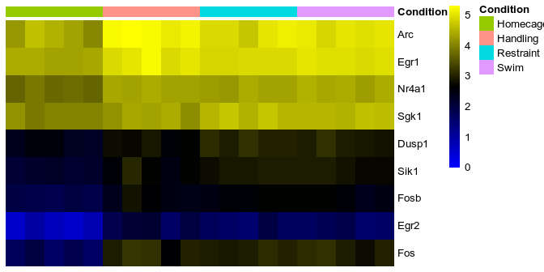<!-- -->

```r
sehm(SE, genes=g, do.scale=TRUE)
```

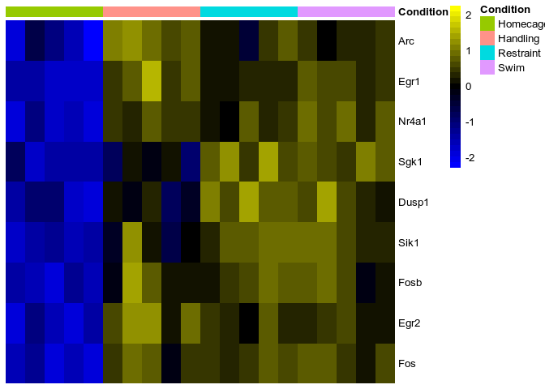<!-- -->

When scaling data, the function will automatically center the colour scale around zero, and handle the extreme values (0.5\% percentile on each side) in a non-linear fashion to retain a useful visualization.
This behavior can be manually controlled via the `breaks` parameter (either setting it to FALSE, to a percentile until which the scale should be linear, of manually inputting breaks).

Annotation from the object's `rowData` and `colData` can be plotted simply by specifying the column name (some will be shown by default if found):

```r
sehm(SE, genes=g, do.scale=TRUE, anno_rows="meanTPM")
```

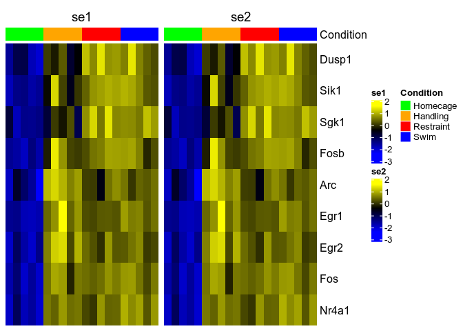<!-- -->

These can also be used to create gaps:

```r
sehm(SE, genes=g, do.scale=TRUE, anno_rows="meanTPM", gaps_at="Condition")
```

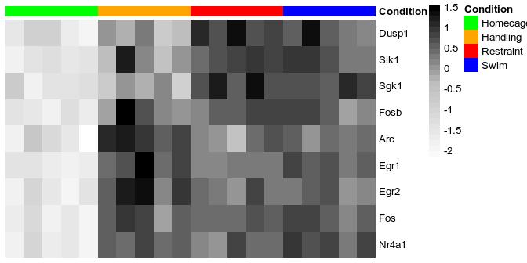<!-- -->

The specific assay to use for plotting can be specified with the `assayName` argument.

#### Row/column ordering

By default, rows are sorted not with hierarchical clustering, but from the angle on a MDS plot, which tends to give nicer results than bottom-up hierarchical clustering. This can be disabled using `sortRowsOn=NULL` or `cluster_rows=TRUE` (to avoid any row reordering and use the order given, use `sortRowsOn=NULL, cluster_rows=FALSE`). Column clustering is disabled by default, but this can be changed with `cluster_cols=TRUE`.

It is common to cluster features into groups, and such a clustering can be used simultaneously with row sorting using the `toporder` argument. For instance:


```r
lfcs <- assays(SE)$logcpm-rowMeans(assays(SE)$logcpm[,which(SE$Condition=="Homecage")])
rowData(SE)$cluster <- as.character(kmeans(lfcs,4)$cluster)
sehm(SE, scale="row", anno_rows="cluster", toporder="cluster", gaps_at="Condition")
```

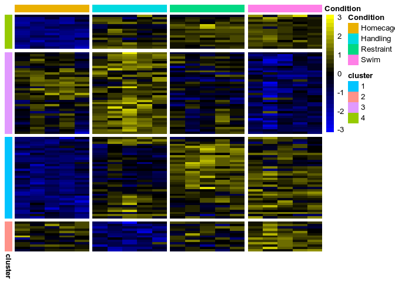<!-- -->

#### Default arguments

For some arguments (for instance colors), if they are not specified in the function call, `SEtools` will try to see whether the object itself contains it, or whether the corresponding global options have been set, before using default colors. This means that if, in the context of a given project, the same colors are repeatedly being used, they can be specified a single time, and all subsequent plots will be affected.

Storing colors in the object:

```r
metadata(SE)$hmcols <- c("purple","white","gold")
ancols <- list( Condition=c( Homecage="#DB918B",
                             Handling="#B86FD3",
                             Restraint="#A9CED5",
                             Swim="#B5DF7C" ) )
metadata(SE)$anno_colors <- ancols
sehm(SE, g, do.scale = TRUE)
```

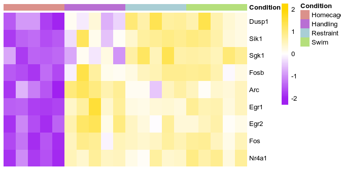<!-- -->


Using the global options:

```r
options("SEtools_def_hmcols"=c("white","grey","black"))
options("SEtools_def_anno_colors"=ancols)
sehm(SE, g, do.scale = TRUE)
```

<!-- -->

At the moment, the following arguments can be set as global options:
`assayName`, `hmcols`, `anno_columns`, `anno_rows`, `anno_colors`, `gaps_at`, `breaks`.
Options must be set with the prefix `SEtools_def_`, followed by the name of the argument.

To remove the predefined colors:


```r
resetAllSEtoolsOptions()
metadata(SE)$hmcols <- NULL
metadata(SE)$anno_colors <- NULL
```

In order of priority, the arguments in the function call trump the object's metadata, which trumps the global options.

<br/><br/>


### sechm and crossHm

The `sechm` function works like the `sehm` function, but the fact that it outputs a `Heatmap` object from [ComplexHeatmap](https://jokergoo.github.io/ComplexHeatmap-reference/book/) means that these can be easily combined:


```r
sechm(SE, g, do.scale = TRUE) + sechm(SE, g, do.scale = FALSE)
```

```
## Warning: Row names of heatmap 2 is not consistent as the main heatmap (1)
```

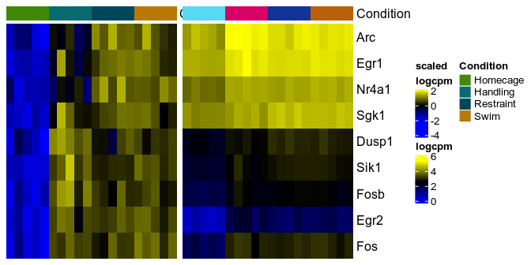<!-- -->

However, doing so involves manual work to ensure that the labels and colors are nice and coherent, and that the rows names match. As a convenience, we provide the `crossHm` function to handle these issues. `crossHm` works with a list of `SummarizedExperiment` objects:


```r
# we build another SE object:
SE2 <- SE
assays(SE2)$logcpm <- jitter(assays(SE2)$logcpm, factor=1000)
crossHm(list(SE1=SE, SE2=SE2), g, do.scale = TRUE)
```

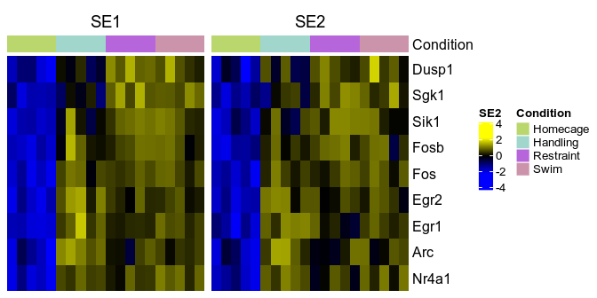<!-- -->

A unique color scale can be enforced:


```r
crossHm(list(SE1=SE, SE2=SE2), g, do.scale = TRUE, uniqueScale = TRUE)
```

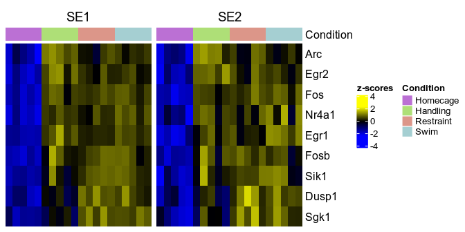<!-- -->

<br/>

***

<br/>

## Merging and aggregating SEs


```r
se1 <- SE[,1:10]
se2 <- SE[,11:20]
se3 <- mergeSEs( list(se1=se1, se2=se2) )
se3
```

```
## class: SummarizedExperiment 
## dim: 100 20 
## metadata(3): se1 se2 anno_colors
## assays(2): counts logcpm
## rownames(100): AC139063.2 Actr6 ... Zfp667 Zfp930
## rowData names(3): meanCPM meanTPM cluster
## colnames(20): se1.HC.Homecage.1 se1.HC.Homecage.2 ...
##   se2.HC.Swim.4 se2.HC.Swim.5
## colData names(3): Dataset Region Condition
```

All assays were merged, along with rowData and colData slots.

By default, row z-scores are calculated for each object when merging. This can be prevented with:

```r
se3 <- mergeSEs( list(se1=se1, se2=se2), do.scale=FALSE)
```

If more than one assay is present, one can specify a different scaling behavior for each assay:

```r
se3 <- mergeSEs( list(se1=se1, se2=se2), use.assays=c("counts", "logcpm"), do.scale=c(FALSE, TRUE))
```

### Merging by rowData columns

It is also possible to merge by rowData columns, which are specified through the `mergeBy` argument. 
In this case, one can have one-to-many and many-to-many mappings, in which case two behaviors are possible:

* By default, all combinations will be reported, which means that the same feature of one object might appear multiple times in the output because it matches multiple features of another object.
* If a function is passed through `aggFun`, the features of each object will by aggregated by `mergeBy` using this function before merging.


```r
rowData(se1)$metafeature <- sample(LETTERS,nrow(se1),replace = TRUE)
rowData(se2)$metafeature <- sample(LETTERS,nrow(se2),replace = TRUE)
se3 <- mergeSEs( list(se1=se1, se2=se2), do.scale=FALSE, mergeBy="metafeature", aggFun=median)
```

```
## Aggregating the objects by metafeature
## Merging...
```

```r
sehm(se3)
```

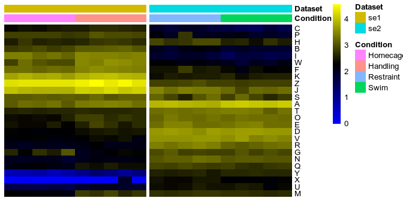<!-- -->

<br/><br/>


### Aggregating a SE

A single SE can also be aggregated by using the `aggSE` function:


```r
se1b <- aggSE(se1, by = "metafeature")
```

```
## Aggregation methods for each assay:
## counts: sum; logcpm: expsum
```

```r
se1b
```

```
## class: SummarizedExperiment 
## dim: 26 10 
## metadata(0):
## assays(2): counts logcpm
## rownames(26): A B ... Y Z
## rowData names(4): meanCPM meanTPM cluster metafeature
## colnames(10): HC.Homecage.1 HC.Homecage.2 ... HC.Handling.4
##   HC.Handling.5
## colData names(2): Region Condition
```

If the aggregation function(s) are not specified, `aggSE` will try to guess decent aggregation functions from the assay names.

<br/>

***

<br/>

## Melting SE

To facilitate plotting features with *[ggplot2](https://CRAN.R-project.org/package=ggplot2)*, the `meltSE` function combines assay values along with row/column data:


```r
d <- meltSE(SE, genes=g[1:4])
head(d)
```

```
##   feature        sample Region Condition counts    logcpm
## 1    Egr1 HC.Homecage.1     HC  Homecage 1581.0 4.4284969
## 2   Nr4a1 HC.Homecage.1     HC  Homecage  750.0 3.6958917
## 3     Fos HC.Homecage.1     HC  Homecage   91.4 1.7556317
## 4    Egr2 HC.Homecage.1     HC  Homecage   15.1 0.5826999
## 5    Egr1 HC.Homecage.2     HC  Homecage 1423.0 4.4415828
## 6   Nr4a1 HC.Homecage.2     HC  Homecage  841.0 3.9237691
```

```r
suppressPackageStartupMessages(library(ggplot2))
ggplot(d, aes(Condition, counts, fill=Condition)) + geom_violin() + 
    facet_wrap(~feature, scale="free")
```

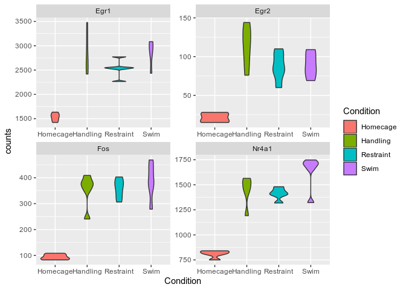

<br/><br/>

# Session info {.unnumbered}


```
## R version 3.6.1 (2019-07-05)
## Platform: x86_64-pc-linux-gnu (64-bit)
## Running under: Ubuntu 18.04.3 LTS
## 
## Matrix products: default
## BLAS:   /usr/lib/x86_64-linux-gnu/openblas/libblas.so.3
## LAPACK: /usr/lib/x86_64-linux-gnu/libopenblasp-r0.2.20.so
## 
## locale:
##  [1] LC_CTYPE=en_US.UTF-8       LC_NUMERIC=C              
##  [3] LC_TIME=de_CH.UTF-8        LC_COLLATE=en_US.UTF-8    
##  [5] LC_MONETARY=de_CH.UTF-8    LC_MESSAGES=en_US.UTF-8   
##  [7] LC_PAPER=de_CH.UTF-8       LC_NAME=C                 
##  [9] LC_ADDRESS=C               LC_TELEPHONE=C            
## [11] LC_MEASUREMENT=de_CH.UTF-8 LC_IDENTIFICATION=C       
## 
## attached base packages:
## [1] parallel  stats4    stats     graphics  grDevices utils     datasets 
## [8] methods   base     
## 
## other attached packages:
##  [1] ggplot2_3.2.1               SEtools_1.1.2              
##  [3] SummarizedExperiment_1.15.8 DelayedArray_0.11.4        
##  [5] BiocParallel_1.19.2         matrixStats_0.55.0         
##  [7] Biobase_2.45.1              GenomicRanges_1.38.0       
##  [9] GenomeInfoDb_1.21.1         IRanges_2.19.14            
## [11] S4Vectors_0.23.21           BiocGenerics_0.31.5        
## [13] BiocStyle_2.13.2           
## 
## loaded via a namespace (and not attached):
##  [1] viridis_0.5.1          edgeR_3.27.13          viridisLite_0.3.0     
##  [4] jsonlite_1.6           foreach_1.4.7          gtools_3.8.1          
##  [7] assertthat_0.2.1       highr_0.8              BiocManager_1.30.4    
## [10] GenomeInfoDbData_1.2.1 yaml_2.2.0             pillar_1.4.2          
## [13] lattice_0.20-38        glue_1.3.1             limma_3.41.15         
## [16] digest_0.6.20          RColorBrewer_1.1-2     XVector_0.25.0        
## [19] colorspace_1.4-1       htmltools_0.3.6        Matrix_1.2-17         
## [22] pkgconfig_2.0.2        pheatmap_1.0.12        GetoptLong_0.1.7      
## [25] zlibbioc_1.31.0        purrr_0.3.2            scales_1.0.0          
## [28] gdata_2.18.0           Rtsne_0.15             tibble_2.1.3          
## [31] withr_2.1.2            randomcoloR_1.1.0      lazyeval_0.2.2        
## [34] magrittr_1.5           crayon_1.3.4           evaluate_0.14         
## [37] MASS_7.3-51.4          gplots_3.0.1.1         tools_3.6.1           
## [40] registry_0.5-1         data.table_1.12.2      GlobalOptions_0.1.0   
## [43] ComplexHeatmap_2.2.0   stringr_1.4.0          V8_2.3                
## [46] munsell_0.5.0          locfit_1.5-9.1         cluster_2.1.0         
## [49] compiler_3.6.1         caTools_1.17.1.2       rlang_0.4.0           
## [52] grid_3.6.1             RCurl_1.95-4.12        iterators_1.0.12      
## [55] rjson_0.2.20           circlize_0.4.7         labeling_0.3          
## [58] bitops_1.0-6           rmarkdown_1.15         gtable_0.3.0          
## [61] codetools_0.2-16       curl_4.0               TSP_1.1-7             
## [64] R6_2.4.0               gridExtra_2.3          seriation_1.2-8       
## [67] knitr_1.24             dplyr_0.8.3            clue_0.3-57           
## [70] KernSmooth_2.23-15     dendextend_1.12.0      shape_1.4.4           
## [73] stringi_1.4.3          Rcpp_1.0.2             png_0.1-7             
## [76] tidyselect_0.2.5       gclus_1.3.2            xfun_0.9
```
